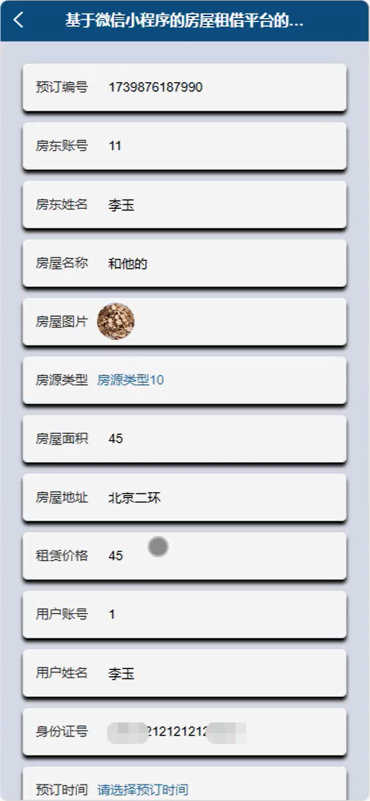

# mpweixinA209D
mpweixinA209D房屋租赁租借微信小程序
 
## 源码问题查看主页咨询

### 一、关键词
房源信息管理，预订信息，电子合同管理

### 二、作品包含
源码+数据库+全套环境和工具资源+本地部署教程

### 三、项目技术
前端技术： Html、Css、Js、Vue3.0、Element-plus
后端技术：Java、SpringBoot3.0、MyBatis

### 四、运行环境（以下版本亲测，其他版本兼容性请自行测试）
开发工具：IDEA/eclipse  + VSCODE + 微信开发者工具

数据库：MySQL5.7（最低要5.7版本）

数据库管理工具：Navicat10以上版本

环境配置软件： JDK17 + Maven3.6.3

前端Nodejs：20

浏览器：谷歌浏览器

### 五、项目介绍
项目编号：mpweixinA209D

房屋租赁租借微信小程序为房东和管理者提供高效的房源与租客管理服务，实现租赁业务的数字化与智能化。

角色：管理员、用户、房东

管理员：首页、系统管理、用户管理、房源信息管理、预订信息、电子合同管理。

用户：首页、房源信息、我的、预订信息、电子合同、我的收藏、聊天记录、修改密码。

房东：首页、房源信息管理、预订信息、电子合同管理。

### 六、运行截图

